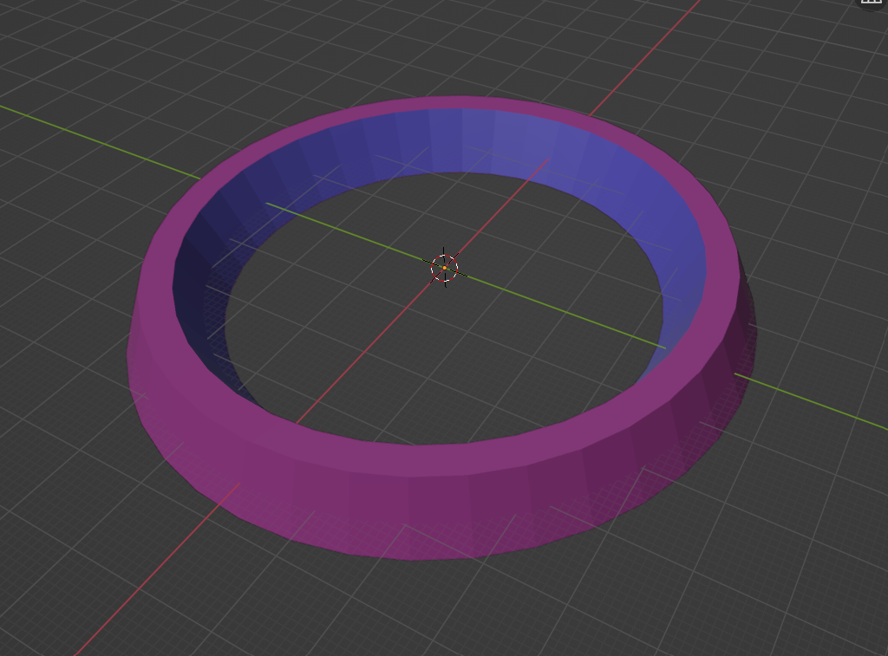
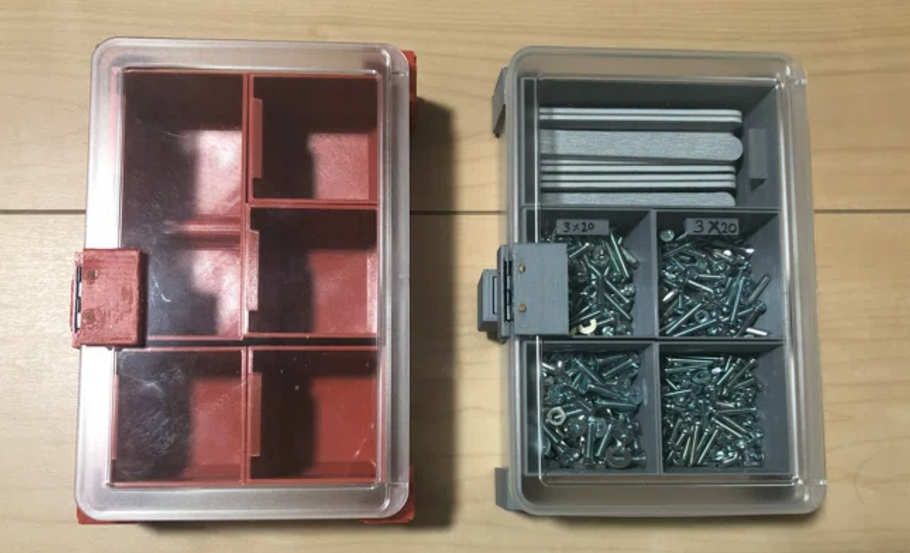
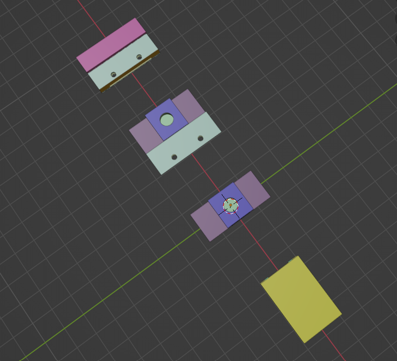
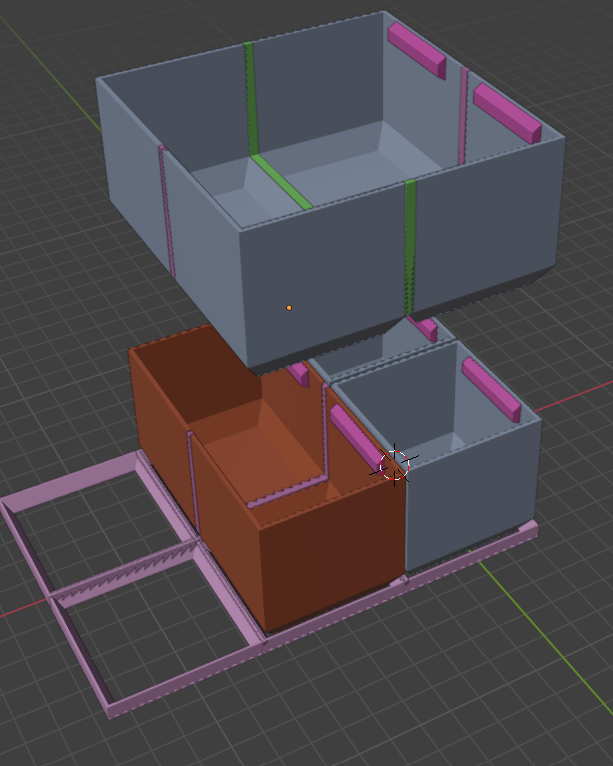
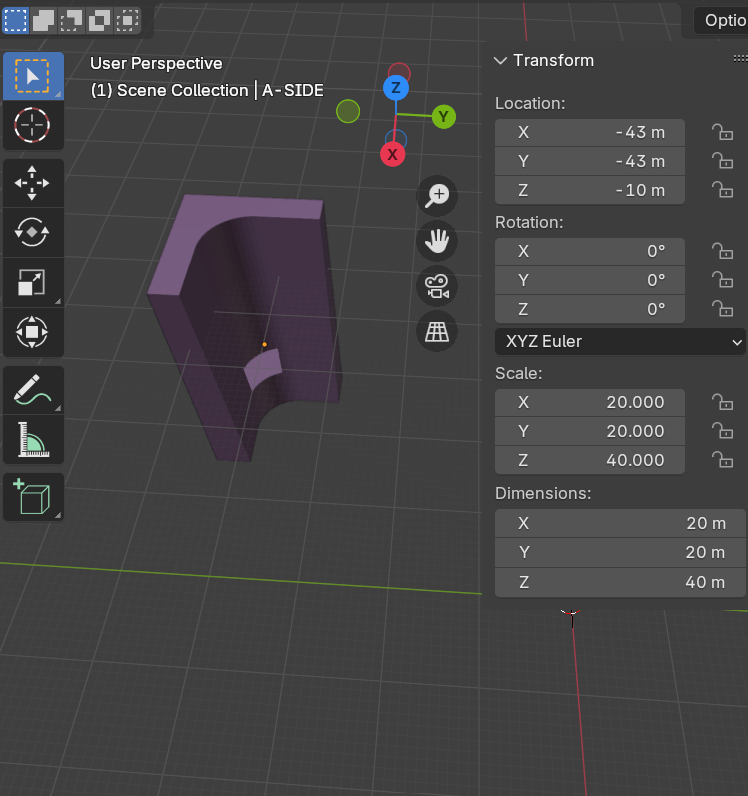

# Blender_Python-script

## Blender+Pythonで3Dオブジェクトを作ります

3DCGソフトのBlenderで、Pythonスクリプトを使い3Dオブジェクトを作成します。
作成したオブジェクトは主に3Dプリンターで造形することを目的にしています。

以下の動画はBlenderで3Dオブジェクトを作成し3Dプリンターで造形するまでのながれです。

## スクリプト

使用方法は、スクリプトをコピーしBlenderのPythonスクリプト欄に貼り付けます。

### 01_fixing-base-for-camera-device.txt

カメラモジュールの固定台を作りました。

### 02_raspberry-pi-fixing-plate.txt

Raspberry Pi を固定する板です。

### 03_wall-block.txt

並べると壁になる壁ブロック

### 04_perforated-plate.txt

等間隔に丸い穴のあいた板

### 05_obniz-fixed-block.txt

obniz Board 1Y を固定するブロック

### 06_シャープ測距モジュール_GP2Y0A21YK_固定台

### 07_MDFボードの留め具

- できるだけ簡単に箱を作る留め具を3Dプリンターで作りたい
- MDF材(100mm x 100mm x 6mm)と3DCGで作った留め具で箱を作りたい
- MDF材にはできるだけ加工しなように工夫した。
- MDF材には電動ドリルで直径5mmの穴を各板に4つ空けるだけ。

### 11_カップ置き.txt

- カップ置き
    - 

### 13_100均プラケースの縦置きと内分け

- 13_01_100均プラケース_留め具.txt
    - 
- 13_02_100均プラケース_内箱とガイド.txt
    - 
- 13_03_100均プラケース_外側の縦置きガイド.txt
    - 
